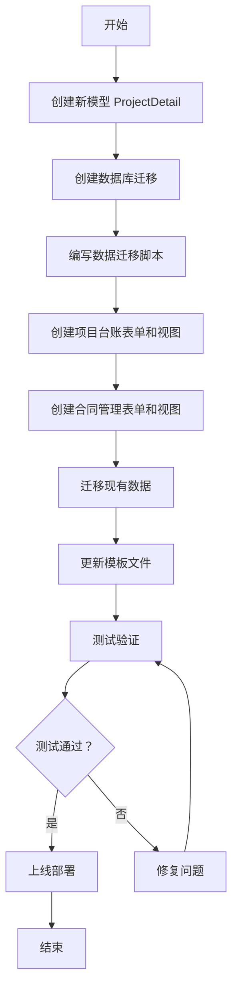

# 项目与合同数据结构重构实施方案

## 📋 需求分析

### **第一步：创建监理项目信息总表（项目详情表）**

完整字段清单（38 个字段）：

#### **基础信息**
1. 项目月报 - BooleanField (需要/不需要)
2. 项目编号 - CharField (唯一索引)
3. 合同编号 - CharField
4. 项目名称 - CharField
5. 项目状态 - ChoiceField
6. 合同状态 - ChoiceField
7. 结算情况 - ChoiceField
8. 合同甲方 - CharField
9. 合同乙方 - CharField
10. 签订日期 - DateField
11. 合同文本 - FileField (可预览)
12. 合同总价（元）- DecimalField
13. 付款约定 - TextField
14. 累计回款 - DecimalField
15. 合同余款 - DecimalField

#### **项目属性**
16. 项目规模 - CharField
17. 项目总投资（万元）- DecimalField
18. 项目地址 - CharField
19. 约定人员配备 - CharField
20. 服务周期 - CharField
21. 服务到期日期 - DateField
22. 延期约定 - CharField
23. 实际延期情况 - CharField

#### **建设手续**
24. 报建情况 - ChoiceField
25. 施工许可证 - FileField (可预览)

#### **进度管理**
26. 进场通知 - ChoiceField
27. 进场通知书 - FileField (可预览)
28. 进场时间 - DateField
29. 计划开工日期 - DateField
30. 实际开工日期 - DateField
31. 预计竣工日期 - DateField

#### **人员信息**
32. 项目总监 - CharField
33. 现场负责人 - CharField
34. 联系电话 - CharField

#### **其他**
35. 备注 - TextField
36. 合同类别 - ChoiceField
37. 创建时间 - DateTimeField (自动)
38. 更新时间 - DateTimeField (自动)

---

### **第二步：项目台账子模块（28 个字段）**

从总表中提取以下字段：

#### **列表显示字段**
- 项目月报（下拉：需要/不需要）
- 项目编号（文本）
- 合同编号（文本）
- 项目名称（文本）
- 项目状态（下拉：未开工/在施工/在停工/已完工）
- 合同状态（下拉：待审核/在执行/已终止/已解除）
- 合同甲方（文本）
- 合同乙方（文本）
- 合同总价（元）（数字）
- 累计回款（数字）
- 合同余款（数字）
- 项目地址（文本）
- 进场时间（日期）
- 预计竣工日期（日期）
- 项目总监（文本）
- 现场负责人（文本）
- 操作按钮

#### **编辑窗体字段**（新增以下字段）
- 合同文本（上传附件，可预览）
- 付款约定（文本）
- 项目规模（文本）
- 项目总投资（万元）（文本/数字）
- 服务周期（文本）
- 服务到期日期（日期）
- 延期约定（文本）
- 实际延期情况（文本）
- 报建情况（下拉：已完成/未完成）
- 施工许可证（上传附件，可预览）
- 进场通知（下拉：有/无）
- 进场通知书（上传附件，可预览）
- 实际开工日期（日期）
- 联系电话（文本）
- 备注（文本）

---

### **第三步：合同管理模块（22 个字段）**

从总表中提取以下字段：

#### **列表显示字段**
- 合同类别（下拉：工程监理/造价咨询/检测/全过程咨询）
- 合同编号（文本）
- 项目名称（文本）
- 合同状态（下拉：待审核/在执行/已终止/已解除）
- 结算情况（下拉：未结算/已结算）
- 合同甲方（文本）
- 合同乙方（文本）
- 签订日期（日期）
- 合同总价（元）（数字）
- 项目地址（文本）
- 操作按钮

#### **编辑窗体字段**（新增以下字段）
- 合同文本（上传附件，可预览）
- 付款约定（文本）
- 项目规模（文本）
- 项目总投资（万元）（文本/数字）
- 约定人员配备（文本）
- 服务周期（文本）
- 服务到期日期（日期）
- 延期约定（文本）
- 计划开工日期（日期）
- 预计竣工日期（日期）
- 备注（文本）

---

## 🏗️ 数据库设计

### **方案选择**

#### **方案 A：单表 + 视图（推荐）**
- 创建一个完整的 `ProjectDetail` 表（38 个字段）
- 项目台账和合同管理通过视图或查询集展示不同字段
- 优点：数据一致性高，维护简单
- 缺点：表较大

#### **方案 B：主表 + 扩展表**
- `Project` 主表（基础信息）
- `ProjectContract` 扩展表（合同相关信息）
- 优点：结构清晰
- 缺点：查询复杂

#### **方案 C：完全独立**
- `ProjectLedger` 项目台账表
- `ContractManagement` 合同管理表
- 通过项目编号关联
- 优点：模块独立
- 缺点：数据冗余，同步困难

**推荐采用方案 A**：单表存储所有信息，通过不同的视图和表单展示

---

## 📝 实施步骤

### **Step 1: 创建新的项目详情模型** ✅
```python
# eims_app/models/model_project_detail.py
class ProjectDetail(models.Model):
    """监理项目信息总表"""
    
    # ===== 基础信息 =====
    monthly_report_required = models.BooleanField("项目月报", default=False)
    project_code = models.CharField("项目编号", max_length=50, unique=True, db_index=True)
    contract_code = models.CharField("合同编号", max_length=50, db_index=True)
    project_name = models.CharField("项目名称", max_length=200, db_index=True)
    
    # 项目状态
    PROJECT_STATUS_CHOICES = [
        ('not_started', '未开工'),
        ('under_construction', '在施工'),
        ('stopped', '在停工'),
        ('completed', '已完工'),
    ]
    project_status = models.CharField("项目状态", max_length=20, choices=PROJECT_STATUS_CHOICES)
    
    # 合同状态
    CONTRACT_STATUS_CHOICES = [
        ('pending_review', '待审核'),
        ('executing', '在执行'),
        ('terminated', '已终止'),
        ('released', '已解除'),
    ]
    contract_status = models.CharField("合同状态", max_length=20, choices=CONTRACT_STATUS_CHOICES)
    
    # 结算情况
    SETTLEMENT_STATUS_CHOICES = [
        ('unsettled', '未结算'),
        ('settled', '已结算'),
    ]
    settlement_status = models.CharField("结算情况", max_length=20, choices=SETTLEMENT_STATUS_CHOICES)
    
    # 合同双方
    contract_party_a = models.CharField("合同甲方", max_length=200)
    contract_party_b = models.CharField("合同乙方", max_length=200)
    
    # 合同签订
    signing_date = models.DateField("签订日期")
    contract_text = models.FileField("合同文本", upload_to='contract_texts/', blank=True)
    contract_amount = models.DecimalField("合同总价 (元)", max_digits=15, decimal_places=2)
    payment_agreement = models.TextField("付款约定", blank=True)
    
    # 回款信息
    cumulative_payment = models.DecimalField("累计回款", max_digits=15, decimal_places=2, default=0)
    contract_balance = models.DecimalField("合同余款", max_digits=15, decimal_places=2, default=0)
    
    # ... (继续定义其他字段)
```

---

### **Step 2: 创建项目台账表单** ✅
```python
# eims_app/forms/form_project_ledger.py
class ProjectLedgerForm(forms.ModelForm):
    """项目台账表单"""
    
    class Meta:
        model = ProjectDetail
        fields = [
            'monthly_report_required', 'project_code', 'contract_code', 
            'project_name', 'project_status', 'contract_status',
            # ... 其他字段
        ]
        widgets = {
            'monthly_report_required': forms.Select(choices=[(True, '需要'), (False, '不需要')]),
            'project_status': forms.Select(choices=ProjectDetail.PROJECT_STATUS_CHOICES),
            'contract_status': forms.Select(choices=ProjectDetail.CONTRACT_STATUS_CHOICES),
            # ... 其他 widget 配置
        }
```

---

### **Step 3: 创建合同管理表单** ✅
```python
# eims_app/forms/form_contract_management.py
class ContractManagementForm(forms.ModelForm):
    """合同管理表单"""
    
    class Meta:
        model = ProjectDetail
        fields = [
            'contract_category', 'contract_code', 'project_name',
            'contract_status', 'settlement_status',
            # ... 其他字段
        ]
        widgets = {
            'contract_category': forms.Select(choices=ProjectDetail.CONTRACT_CATEGORY_CHOICES),
            # ... 其他 widget 配置
        }
```

---

### **Step 4: 迁移现有数据** ⚠️

编写数据迁移脚本：

```python
# eims_app/migrations/00xx_migrate_project_data.py
def migrate_data(apps, schema_editor):
    Project = apps.get_model('eims_app', 'Project')
    Contract = apps.get_model('eims_app', 'Contract')
    ProjectDetail = apps.get_model('eims_app', 'ProjectDetail')
    
    for project in Project.objects.all():
        # 查找关联的合同
        contracts = Contract.objects.filter(project_code=project.project_code)
        
        # 合并数据创建 ProjectDetail
        detail = ProjectDetail.objects.create(
            project_code=project.project_code,
            project_name=project.project_name,
            project_status=project.project_status,
            # ... 映射其他字段
        )
```

---

## 🎯 关键决策点

### **1. 数据同步策略**

#### **选项 A：实时同步**
- 项目台账修改后自动更新合同管理
- 使用 Django signals 实现
- 优点：数据一致性好
- 缺点：逻辑复杂

#### **选项 B：独立编辑**
- 两个模块各自独立编辑
- 通过共享字段（项目编号）关联
- 优点：简单直接
- 缺点：可能数据不一致

**建议采用选项 B**：两个模块独立编辑，减少复杂度

---

### **2. 文件上传处理**

#### **合同文本、施工许可证、进场通知书**

```python
# 上传路径配置
MEDIA_ROOT = 'media/'
contract_texts/     # 合同文本
construction_permits/  # 施工许可证
entry_notices/    # 进场通知书

# 预览功能实现
def preview_file(request, file_id):
    file_obj = get_object_or_404(ProjectDetail, id=file_id)
    return FileResponse(file_obj.contract_text.open())
```

---

### **3. 权限控制**

#### **项目台账权限**
- 查看：所有登录用户
- 新增/编辑：项目经理、现场负责人
- 删除：超级管理员

#### **合同管理权限**
- 查看：所有登录用户
- 新增/编辑：合同管理员、超级管理员
- 删除：超级管理员

---

## 📊 字段映射关系

### **从现有 Project 模型迁移**

| 新字段 | 原字段 | 转换方式 |
|--------|--------|----------|
| project_code | project_code | 直接映射 |
| project_name | project_name | 直接映射 |
| project_status | project_status | 调整选项值 |
| project_address | project_address | 直接映射 |
| project_scale | project_scale | 直接映射 |
| project_investment | project_investment | 直接映射 |
| entry_time | entry_time | 直接映射 |
| planned_completion_time | estimated_completion_date | 重命名 |
| project_director | project_director | 直接映射 |
| project_manager | project_manager | 直接映射 |
| remark | remark | 直接映射 |

### **从现有 Contract 模型迁移**

| 新字段 | 原字段 | 转换方式 |
|--------|--------|----------|
| contract_code | contract_code | 直接映射 |
| contract_status | status | 调整选项值 |
| contract_party_a | party_a | 直接映射 |
| contract_party_b | contract_party_b | 直接映射 |
| contract_amount | contract_amount | 直接映射 |
| signing_date | signing_time | 重命名 |
| contract_text | contract_text | 直接映射 |
| payment_agreement | payment_agreement | 直接映射 |
| project_name | project_name | 直接映射 |
| project_address | project_address | 直接映射 |
| project_scale | project_scale | 直接映射 |
| project_investment | project_investment | 直接映射 |
| service_period | service_period | 直接映射 |
| service_deadline | service_deadline | 直接映射 |
| extension_agreement | extension_agreement | 直接映射 |

---

## ⚠️ 注意事项

### **1. 数据库兼容性**
- 保留原有 Project 和 Contract 表
- 新建 ProjectDetail 表
- 逐步迁移数据
- 确认无误后再删除旧表

### **2. 前端适配**
- 更新所有相关模板
- 调整列表显示列
- 修改表单字段
- 测试文件上传和预览

### **3. 业务连续性**
- 选择非工作时间执行迁移
- 做好数据备份
- 准备回滚方案
- 通知相关人员

---

## 🔄 实施流程



---

## ✅ 验收标准

### **功能验收**
- [ ] 项目台账可以正常增删改查
- [ ] 合同管理可以正常增删改查
- [ ] 文件上传功能正常
- [ ] 文件预览功能正常
- [ ] 列表显示正确
- [ ] 表单验证有效

### **数据验收**
- [ ] 现有 Project 数据完整迁移
- [ ] 现有 Contract 数据完整迁移
- [ ] 数据无丢失
- [ ] 数据格式正确
- [ ] 关联关系正确

### **性能验收**
- [ ] 列表加载速度 < 2 秒
- [ ] 表单提交响应 < 1 秒
- [ ] 文件上传稳定
- [ ] 文件预览流畅

---

下一步将创建详细的代码实现！
